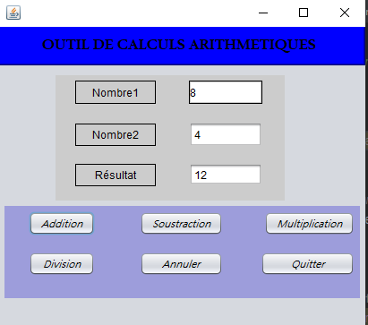
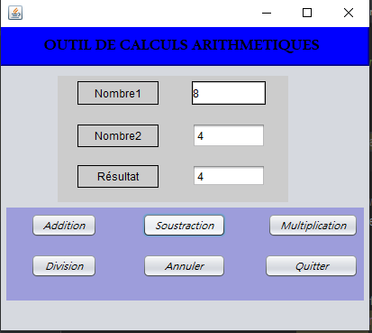
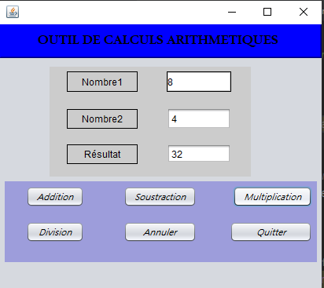

# OutilCalculArithmetique
Une petite interface, réalisée avec la bibliothèque Swing de JFC, qui permet des opérations arithmétiques de base telles que l'addition, la soustraction, la multiplication et la division

